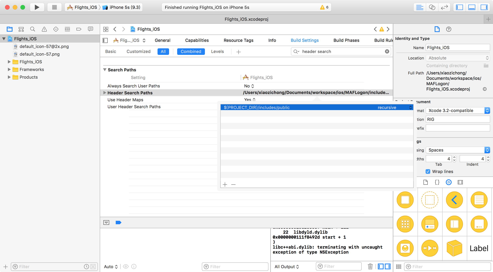
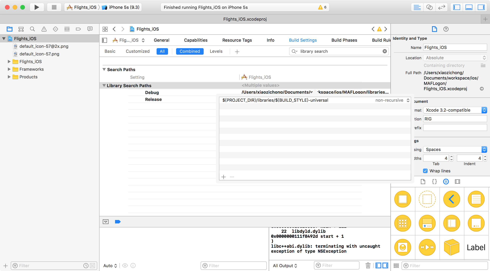
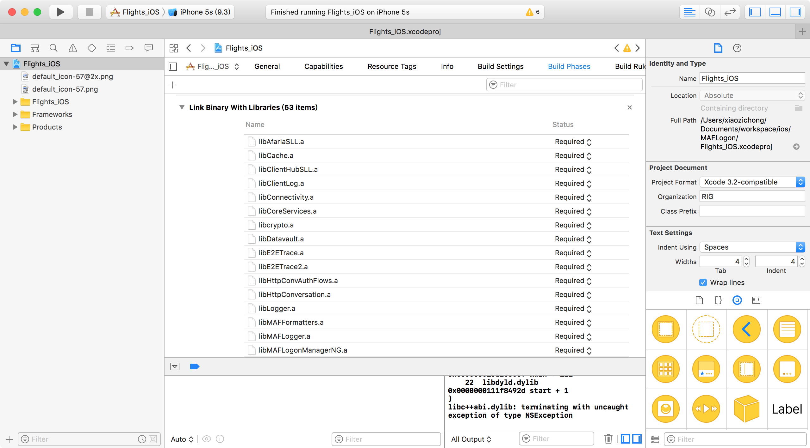

# MAFLogon

## import SMP SDK

### set header search path

```
$(PROJECT_DIR)/includes/public
```



### set Library search path

```
$(PROJECT_DIR)/libraries/$(BUILD_STYLE)-universal
```



### add libraries in build phases

add libraries from libraries folder.


